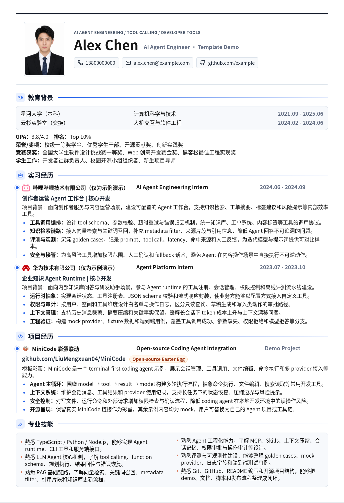

# VibeResume · Vibe 简历

[](LICENSE)
[](package.json)
[](scripts/export-pdf.mjs)
[](#像-vibe-coding-一样编辑简历)
[](skills/vibe-resume-editor/SKILL.md)
[](https://github.com/LiuMengxuan04/vibe-resume)

> 像 vibe coding 一样编辑你的简历：告诉 AI 你想怎么改，它直接修改网页简历，再一键导出为 PDF。

VibeResume 是一个 **AI 友好、网页优先、可导出 PDF 的简历模板**。你不需要在 Word、LaTeX 或浏览器打印预览里反复对齐版式；把简历维护成 `HTML + CSS`，让 AI 帮你改内容和排版，然后用脚本把网页看到的布局稳定导出成一页 PDF。

[English](#english)



- 示例网页：打开 `index.html`
- 示例 PDF：[export/vibe-resume-demo.pdf](export/vibe-resume-demo.pdf)
- AI 使用说明：[skills/vibe-resume-editor/SKILL.md](skills/vibe-resume-editor/SKILL.md)

## 为什么做这个项目

传统简历维护经常卡在三个地方：

- 简历内容想让 AI 改，但 Word / PDF 不适合 AI 直接编辑。
- 网页看起来正常，浏览器“打印成 PDF”后版式却错位。
- 针对不同岗位微调简历时，内容、排版、PDF 导出很难形成稳定闭环。

VibeResume 的思路是：**把网页作为简历源文件，把 AI 当作编辑器，把 PDF 当作构建产物。**

## 核心特点

- **像 vibe coding 一样编辑简历**：直接告诉 AI 目标岗位、修改方向和版式要求，让它修改 `index.html` 与 `styles.css`。
- **网页即源文件**：简历内容、布局、图标、链接都在静态 HTML/CSS 中维护，天然适合 Git 版本管理。
- **一键导出 PDF**：使用 Chromium 渲染网页的 `screen` 布局，动态测量 `.page` 高度，导出为单页 PDF。
- **避免打印错位**：不依赖手动浏览器打印，不触发不可控的纸张边距、分页、缩放和 `@media print` 差异。
- **AI 配套 Skill**：仓库内置 `vibe-resume-editor`，可以作为 Codex-style skill 即插即用。
- **开源项目友好**：包含 README、License、示例 PDF、预览截图、导出脚本、依赖锁定和 mock 示例内容。

## 快速开始

安装依赖：

```bash
npm install
```

本地预览：

```bash
npm run preview
```

然后访问：

```text
http://localhost:4173
```

导出 PDF：

```bash
npm run export:pdf
```

默认输出：

```text
export/vibe-resume-demo.pdf
```

也可以指定输出路径：

```bash
./export-pdf.sh export/my-resume.pdf
```

如果脚本找不到浏览器，可以手动指定 Chrome / Chromium：

```bash
CHROME_PATH=/path/to/chrome ./export-pdf.sh
```

## 像 Vibe Coding 一样编辑简历

推荐工作流：

1. 把你的目标岗位、目标公司、简历语言、已有经历和想强调的能力告诉 AI。
2. 让 AI 直接修改 `index.html`，把 mock 内容替换成你的真实简历。
3. 让 AI 调整 `styles.css`，控制密度、字号、宽度、间距、图标和模块顺序。
4. 在浏览器里预览，或者把截图发给 AI 继续微调。
5. 运行 `npm run export:pdf`，检查 PDF 是否仍是一页、内容是否完整。
6. 针对不同 JD 重复这个过程，形成多个岗位版本。

示例 prompt：

```text
请基于这个模板帮我制作 AI Agent 工程实习简历。
保持一页 PDF，突出 tool calling、RAG、Agent runtime、评测和工程化能力。
语气正式，不要堆关键词，不要编造我没有做过的经历。
```

## AI Skill

仓库内置一个 Codex-style skill：

```text
skills/vibe-resume-editor/SKILL.md
```

安装到本机 Codex：

```bash
mkdir -p ~/.codex/skills
cp -R skills/vibe-resume-editor ~/.codex/skills/
```

新开一个 Codex 会话后可以直接说：

```text
使用 vibe-resume-editor skill，把这份 Vibe 简历改成我的真实后端开发实习简历，并导出一页 PDF。
```

如果你的 AI 工具不支持 Codex skills，也可以把 `SKILL.md` 的内容复制到对话中作为项目说明。

## 示例内容声明

这个仓库里的简历内容是模板演示用 mock 数据。

- 姓名、学校、电话、邮箱、奖项、实习角色、项目描述、日期和技能均为虚构示例。
- `assets/avatar.png` 是 AI 生成头像，不是真实人物证件照。
- 华为和哔哩哔哩公司名作为彩蛋保留，并在简历中标注 `（仅为示例演示）`；其下方实习内容不代表真实工作经历。
- MiniCode 作为真实开源项目彩蛋保留：<https://github.com/LiuMengxuan04/MiniCode>。你可以替换成自己的开源项目、论文、产品或作品集。

## 关联项目

VibeResume 负责最后一公里：把简历内容维护成漂亮网页，并稳定导出 PDF。它可以和下面两个项目组成完整求职材料流水线：

- [鼠鼠实习妙妙工具](https://github.com/LiuMengxuan04/shushu-internship-tool)：AI 驱动的实习项目准备工具包。它可以根据目标 JD 选择 GitHub 项目、审计代码仓库、规划运行路径、设计可面试改造点，并生成 STAR 简历项目、核心代码讲解、面试 Q&A 和展示材料。
- [鼠鼠实习简历优化器](https://github.com/Sunanzhe2004/shushu-internship-resume-optimizer)：面向实习材料的简历整理工具。它把代码仓库、项目总结和业务背景等散乱材料先做成果审计，再按目标 JD 排序，生成简历 bullet、项目总结、STAR 草稿、面试 Q&A、风险检查清单和投递前检查表。

组合流程可以是：

```text
shushu-internship-tool
  -> 规划 / 构建 / 理解一个能投递、能面试的项目

shushu-internship-resume-optimizer
  -> 把项目证据、业务背景和经历材料整理成可投递表达

VibeResume
  -> 让 AI 修改网页简历，并导出稳定的一页 PDF
```

## 图标与 Logo

公司和项目 Logo 是可选项。没有合适图标时，直接保留纯文本公司名即可，简历仍然应该完整、正式。

如果要使用矢量图，推荐：

- 自己上传 SVG 到 `assets/logos/` 并在 `index.html` 中引用。
- 给 AI 一个 SVG 直链，让它下载到 `assets/logos/`。
- 让 AI 去 <https://lobehub.com/icons> 搜索公司、产品、框架或开源项目图标。

当前示例中的 Bilibili / Huawei SVG 来自 LobeHub Icons 的静态 SVG 包。公司名、Logo 和商标归各自权利方所有。

## 项目结构

```text
.
├── assets/
│   ├── logos/
│   │   ├── bilibili-color.svg
│   │   └── huawei-color.svg
│   ├── avatar.png
│   ├── minicode-logo.svg
│   └── preview.png
├── export/
│   └── vibe-resume-demo.pdf
├── skills/
│   └── vibe-resume-editor/
│       └── SKILL.md
├── scripts/
│   └── export-pdf.mjs
├── export-pdf.sh
├── index.html
├── styles.css
├── package.json
└── README.md
```

## 为什么不直接用浏览器打印

浏览器打印通常会从 `screen` 媒体切换到 `print` 媒体，触发不同的纸张大小、分页、边距、缩放、字体渲染和 `@media print` 规则，所以导出的 PDF 经常和网页预览不一致。

VibeResume 的导出脚本会打开 `index.html`，强制使用 `screen` 布局，隐藏工具栏，测量 `.page` 元素高度，并按网页实际宽高生成单页 PDF。这样 PDF 更接近你在网页里看到的样子。

## 致谢

VibeResume 的灵感来源之一，是与 [he11x / kexin](https://github.com/he11x) 的聊天交流。感谢这些关于 AI、简历维护和 vibe coding 工作流的讨论带来的启发。

## 开源协议

[MIT](LICENSE)

---

## English

VibeResume is a vibe-coding friendly web-to-PDF resume template. The webpage is the source of truth: ask an AI coding assistant to edit `index.html` and `styles.css`, preview the result in a browser, then export the same screen layout to a one-page PDF.

### Highlights

- **AI-editable resume**: describe what you want, and let an AI agent update the HTML/CSS resume directly.
- **Web-first source**: content, layout, links, icons, and styling are all version-controlled as static files.
- **Stable PDF export**: Chromium renders the screen layout and exports a measured one-page PDF.
- **Print mismatch avoidance**: no manual browser print workflow, no unexpected print-media pagination.
- **Codex-style skill included**: `skills/vibe-resume-editor/SKILL.md` gives agents project-specific editing and validation rules.
- **Open-source ready**: MIT license, badges, preview screenshot, sample PDF, export script, and mock demo content.

### Quick Start

```bash
npm install
npm run preview
npm run export:pdf
```

Default PDF output:

```text
export/vibe-resume-demo.pdf
```

### AI Workflow

1. Share your target role, target JD, resume language, and raw experience notes with an AI assistant.
2. Ask it to replace the mock content in `index.html` with your real resume.
3. Ask it to tune density, section order, typography, spacing, and icons in `styles.css`.
4. Preview the page, send screenshots back to the AI, and iterate.
5. Run `npm run export:pdf` and check the generated PDF.

### Demo Notice

The resume content in this repository is mock data. The avatar is AI-generated. Huawei and Bilibili are retained as easter-egg company-name placeholders and are explicitly marked as demo-only in the resume. The internship details do not describe real work experience. MiniCode is kept as a real open-source easter egg and can be replaced.

### Related Projects

- [shushu-internship-tool](https://github.com/LiuMengxuan04/shushu-internship-tool): turns a target JD into project selection, repository audit, runnable project planning, modification ideas, resume-ready STAR bullets, code explanations, interview Q&A, and presentation materials.
- [shushu-internship-resume-optimizer](https://github.com/Sunanzhe2004/shushu-internship-resume-optimizer): turns scattered internship materials into audited achievements, JD-ranked resume bullets, project summaries, STAR drafts, interview Q&A, risk checks, and application checklists.

Recommended pipeline:

```text
shushu-internship-tool -> shushu-internship-resume-optimizer -> VibeResume
```

### Acknowledgements

One source of inspiration for VibeResume was the conversation with [he11x / kexin](https://github.com/he11x) around AI, resume maintenance, and vibe-coding workflows.

### License

[MIT](LICENSE)
